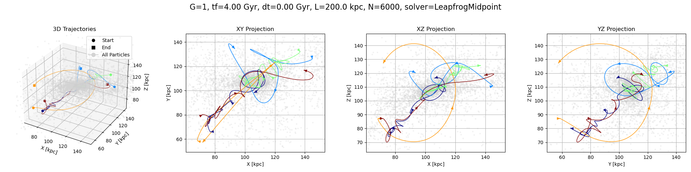
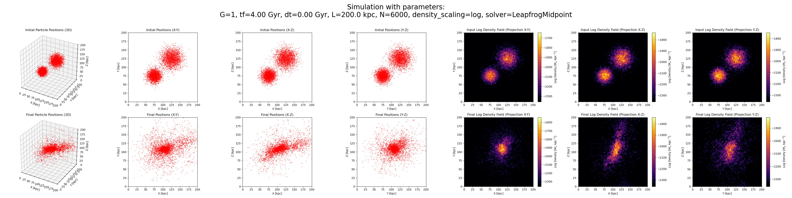

# N-Body Inverse Sampling

A JAX-based framework for N-body simulations and Bayesian parameter inference using gradient-based MCMC sampling. This package allows you to run gravitational N-body simulations with flexible blob-based initialization and perform parameter inference to recover initial conditions from final density fields.



## Table of Contents

- [Features](#features)
- [Installation](#installation)
- [Quick Start](#quick-start)

## Features

- **Flexible N-body simulations** with blob-based initialization
- **Multiple initialization types**: Gaussian, NFW, and Plummer profiles
- **Various velocity distributions**: Cold, virial, and circular
- **Bayesian parameter inference** using HMC, NUTS, MALA, or Random Walk samplers
- **Automatic differentiation** for efficient gradient computation
- **GPU acceleration** with JAX
- **Comprehensive visualization** with automatic plot generation
- **Video generation** of simulation evolution
- **Energy tracking** and conservation monitoring

## Installation

### Prerequisites

- Python 3.10 or higher
- CUDA-compatible GPU (recommended)
- FFmpeg (for video generation, optional)

Libraries:
- jax (>=0.5.3)
- jaxlib (>=0.5.3)
- diffrax (>=0.7.0)
- blackjax (>=1.2.5)

### Step 1: Clone the Repository

```bash
git clone https://github.com/yourusername/diffNBody-for-bayesian-inference.git
cd diffNBody-for-bayesian-inference
```

### Step 2: Create a Conda Environment (Recommended)

```bash
conda create -n diffnbody python=3.10
conda activate diffnbody
```

### Step 3: Install Dependencies

```bash
pip install jax jaxlib diffrax blackjax matplotlib numpy
```
For GPU: see [JAX installation guide](https://jax.readthedocs.io/en/latest/installation.html)

---

## Quick Start

This section provides step-by-step instructions to get you started with N-body simulations and parameter inference. The framework supports two main modes: **simulation** and **sampling**.

---

### 1. Simulation Mode

Simulation mode runs an N-body simulation with predefined initial conditions and generates comprehensive visualizations.

#### Example: High-Resolution Simulation

To run a high-resolution simulation with two Gaussian blobs, use the following command:

```bash
python src/run.py --config configs/dwarf_galaxies/2blob/sim/high_res.yaml
```

This will:
- Initialize 6000 particles distributed across two Gaussian blobs.
- Run the simulation for 4.0 Gyr with a time resolution of 0.001 Gyr.
- Generate density field plots, trajectories, and velocity distributions.
- Save all results to `results/nbody_sim_results/`.

#### Adding Blobs

You can add more blobs to the simulation by modifying the `blobs_params` section in the configuration file. Each blob can have its own initialization type, position, velocity distribution, and other properties. For example:

```yaml
blobs_params:
  - n_part: 3000
    pos_type: gaussian
    pos_params:
      sigma: 6.4
      center: 48
    vel_type: circular
    vel_params:
      vel_factor: 0.1
      vel_dispersion: 0.05
  - n_part: 3000
    pos_type: nfw
    pos_params:
      rs: 9.6
      c: 10.0
      center: 80
    vel_type: virial
    vel_params:
      virial_ratio: 0.5
  - n_part: 2000
    pos_type: plummer
    pos_params:
      rs: 5.0
      center: 64
    vel_type: cold
    vel_params:
      vel_dispersion: 0.02
```

#### Units Conversion System

The framework uses a flexible unit conversion system to map simulation units to physical units. These conversions are defined in the `plot_settings` section of the configuration file:

```yaml
units:
  kpc_per_pixel: 1.5625          # 1 simulation unit = 1.5625 kpc
  msun_per_mass_unit: 8.46e5     # 1 mass unit = 8.46e5 solar masses
  gyr_per_time_unit: 1.0         # 1 time unit = 1 Gyr
  jouleE50_per_unit: 3.94e-8     # 1 energy unit = 3.94e-8 x 10^50 Joules
```

These conversions are automatically applied to plots and outputs, ensuring that results are presented in physical units (e.g., kpc, Gyr, solar masses).

#### Customizing the Simulation

1. **Change the Blob Initialization:**
   - Replace `pos_type: gaussian` with `pos_type: nfw` or `pos_type: plummer` for different density profiles.
   - Adjust parameters like `sigma`, `rs`, or `c` to modify the blob's shape.

2. **Modify the Velocity Distribution:**
   - Use `vel_type: cold`, `vel_type: virial`, or `vel_type: circular` for different velocity setups.
   - Adjust `vel_factor` or `virial_ratio` to control the velocity magnitude.

3. **Enable Additional Features:**
   - Enable energy tracking:
     ```yaml
     plot_settings:
       enable_energy_tracking: true
     ```
   - Generate a video of the simulation:
     ```yaml
     generate_video:
       do: true
       video_fps: 30
       video_dpi: 200
     ```

#### Expected Output

After running the simulation, the results will be saved in a timestamped directory under `results/nbody_sim_results/`:

```
high_res_YYYYMMDD_HHMMSS/
├── config.yaml                          # Copy of your configuration
├── density.png                          # Multi-panel density plots
├── timesteps.png                        # Time evolution snapshots
├── trajectories.png                     # Particle trajectory plots
├── velocity.png                         # Velocity analysis
└── simulation_video.mp4                 # Animation (if enabled)
```

---

### 2. Sampling Mode

Sampling mode allows you to infer the initial conditions of an N-body system from observed final density fields using Bayesian parameter inference. This mode leverages MCMC samplers such as NUTS, HMC, MALA, and Random Walk Metropolis.

#### Example: Sampling with NUTS

To run a sampling experiment using the NUTS sampler, use the following command:

```bash
python src/run.py --config configs/dwarf_galaxies/1blob/sampling/low_res/scalar_center/nuts/nuts_v1.yaml
```

This will:
- Use the NUTS sampler to infer parameters of a single Gaussian blob (e.g., `sigma` and `center`).
- Run 2000 sampling steps with 200 warmup steps for adaptation.
- Save results to `results/sampling_results/`.

#### General Sampling Workflow

1. **Define the Observables:**
   - Specify the observables (e.g., `density`, `vx`, `vy`, `vz`) in the `model_params` section of the configuration file:
     ```yaml
     observable: ["density"]
     ```

2. **Set Priors:**
   - Define prior distributions for the parameters to be inferred in the `prior_params` section:
     ```yaml
     prior_params:
       blob0_sigma: {low: 0.5, high: 5.0}
       blob0_center: {low: 12.0, high: 20.0}
     ```

3. **Choose a Sampler:**
   - Select an MCMC sampler (e.g., `nuts`, `hmc`, `mala`, `rwm`) and configure its parameters:
     ```yaml
     sampler: nuts
     num_samples: 2000
     num_warmup: 200
     ```

4. **Specify Initial Positions:**
   - Provide initial values for the parameters to be inferred:
     ```yaml
     initial_position:
       blob0_sigma: 2.1
       blob0_center: 15.2
     ```

5. **Run the Sampling:**
   - Execute the sampling script with the desired configuration file.

#### Customizing the Sampling

1. **Change the Sampler:**
   - Replace `sampler: nuts` with `hmc`, `mala`, or `rwm` for other sampling methods.
   - Adjust sampler-specific parameters (e.g., `step_size` for HMC).

2. **Add More Blobs:**
   - Add additional blobs to the `blobs_params` section with their own initialization and prior settings.

3. **Modify Priors:**
   - Adjust the `prior_params` to reflect your prior knowledge about the parameters.

4. **Enable Additional Features:**
   - Enable energy tracking or visualization by modifying the `plot_settings` section.

#### Expected Output

After running the sampling experiment, the results will be saved in a timestamped directory under `results/sampling_results/`:

```
nuts_v1_YYYYMMDD_HHMMSS/
├── config.yaml                          # Copy of your configuration
├── trace_sampling.png                   # Trace plots for sampled parameters
├── corner_sampling.png                  # Corner plots for posterior distributions
├── samples.npz                          # Saved samples in NumPy format
└── truth.npz                            # True parameter values for comparison
```

#### Performance Tips

- **Warmup Steps:** Increase `num_warmup` for better adaptation in high-dimensional problems.
- **Sampling Steps:** Use more `num_samples` for higher accuracy in posterior estimation.
- **GPU Usage:** Ensure `cuda_visible_devices` is set correctly for faster sampling.

---

## References

* [JAX documentation](https://jax.readthedocs.io/)
* [Diffrax documentation](https://docs.kidger.site/diffrax/)
* [BlackJAX documentation](https://blackjax-devs.github.io/blackjax/)

## License

MIT License. See `LICENSE`.

